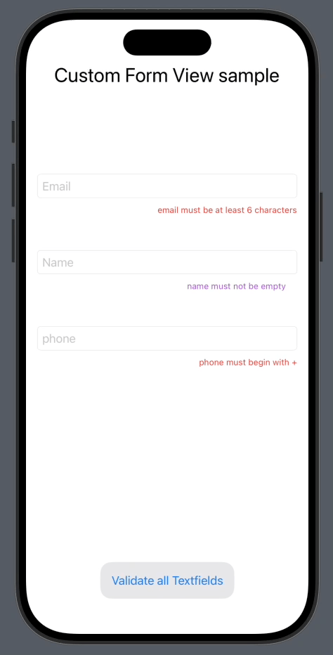
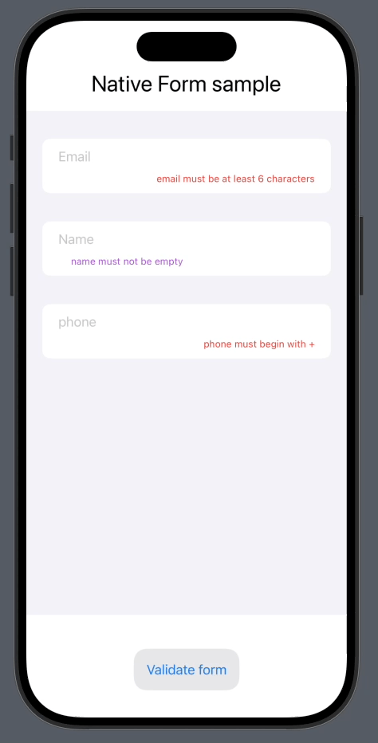

# FormValidationKit


[](https://swift.org/)
[](https://developer.apple.com/ios/)
[](https://swift.org/package-manager/)
[]()

**FormValidationKit** is a lightweight SwiftUI library for **TextField and Form validation**. It provides:

- A simple API to validate individual fields with error messages.
    
- Easy integration with SwiftUI `Form` for native form validation.
    
- The ability to **customize error message display** (color, alignment, style).
    
This project is open source! Anyone is welcome to **fork**, make changes, and submit **pull requests**.

This library is widely inspired by the following article, and I want to credit the author:
[How to validate TextFields in SwiftUI like a pro](https://medium.com/@mhmtkrnlk/how-to-validate-textfields-in-swiftui-like-a-pro-3dbe368d1570)


---

## Installation

### Swift Package Manager

Add the package via URL:

```
https://github.com/your-repo/FormValidationKit.git
```

In Xcode: `File → Swift Packages → Add Package Dependency` → paste the URL.

Then import the library:

```swift
import FormValidationKit
```

---

## Key Concepts

### `ValidationRule`

A validation rule for a field:

```swift
public struct ValidationRule {
    let validate: () -> Bool
    let errorMessage: String?

    public init(validate: @escaping () -> Bool, errorMessage: String?) { ... }
    func evaluate() -> ValidationResult { ... }
}
```

### `ValidationResult`

Validation result:

```swift
public struct ValidationResult: Equatable {
    public let isValid: Bool
    public let errorMessage: String?
}
```

---

## Use Case 1: Custom Form with `TextFormView`



For custom layouts or non-Form views:

```swift
TextFormView { validateAllFields in
    VStack {
        TextField("Email", text: $email)
            .validate([
                ValidationRule(validate: { email.count > 6 }, errorMessage: "Email must be longer than 6 characters")
            ])

        Button("Validate") {
            if validateAllFields() {
                print("Form is valid")
            } else {
                print("Form is invalid")
            }
        }
    }
}
```

- `validateAllFields()` returns `true` if all validations pass.
    
- You can **customize error messages**:


```swift
TextField("Name", text: $name)
    .validate([ValidationRule(validate: { !name.isEmpty }, errorMessage: "Name is required")]) { message in
        Text(message)
            .font(.caption)
            .foregroundStyle(.purple)
            .frame(maxWidth: .infinity, alignment: .trailing)
    }
```

---

## Use Case 2: Native SwiftUI Form



Retrieve all field validations using the `validateForm` extension:

```swift
Form {
    TextField("Email", text: $email)
        .validate([
            ValidationRule(validate: { email.count > 6 }, errorMessage: "Email too short")
        ])

    TextField("Name", text: $name)
        .validate([
            ValidationRule(validate: { !name.isEmpty }, errorMessage: "Name required")
        ])
}
.validateForm { results in
    validationResults = results
}

Button("Validate") {
    if validationResults.allSatisfy({ $0.isValid }) {
        print("Form is valid")
    } else {
        print("Form is invalid")
    }
}
.disabled(!validationResults.allSatisfy({ $0.isValid }))
```

- Each field can have a **custom error view** or use the default style (red caption text).

---

## Customization

- Customize error message via the `errorView` builder.
    

```swift
TextField("Phone", text: $phone)
    .validate([
        ValidationRule(validate: { phone.hasPrefix("+") }, errorMessage: "Must start with +")
    ]) { message in
        Text(message)
            .foregroundStyle(.orange)
            .frame(maxWidth: .infinity, alignment: .trailing)
            .frame(height: 20)
    }
```

---

## Compatibility

- SwiftUI iOS 15+

---

## Examples

- `Examples/ValidateTextFieldsSampleView.swift` → Custom form using `TextFormView`.
    
- `Examples/ValidationFormSample.swift` → Native SwiftUI `Form` using `Form.validateForm`.
    

---

## Package Structure

```
FormValidationKit/
├─ Package.swift
├─ Sources/
│  └─ FormValidationKit/
│      ├─ Form+Extensions.swift
│      ├─ TextField+Extensions.swift
│      ├─ TextFormView.swift
│      ├─ ValidationPreferenceKey.swift
│      ├─ ValidationResult.swift
│      └─ ValidationRule.swift
└─ Tests/
   └─ FormValidationKitDemo/
   │    ├─ ValidateTextFieldsSampleView.swift
   │    └─ ValidationFormSample.swift
   └─ FormValidationKitTests/
        └─ FormValidationKitTests.swift
   
```

---

## License

MIT License – see LICENSE file.

This project is **open source** and welcomes contributions! Feel free to **fork**, make improvements, and submit **pull requests**.

